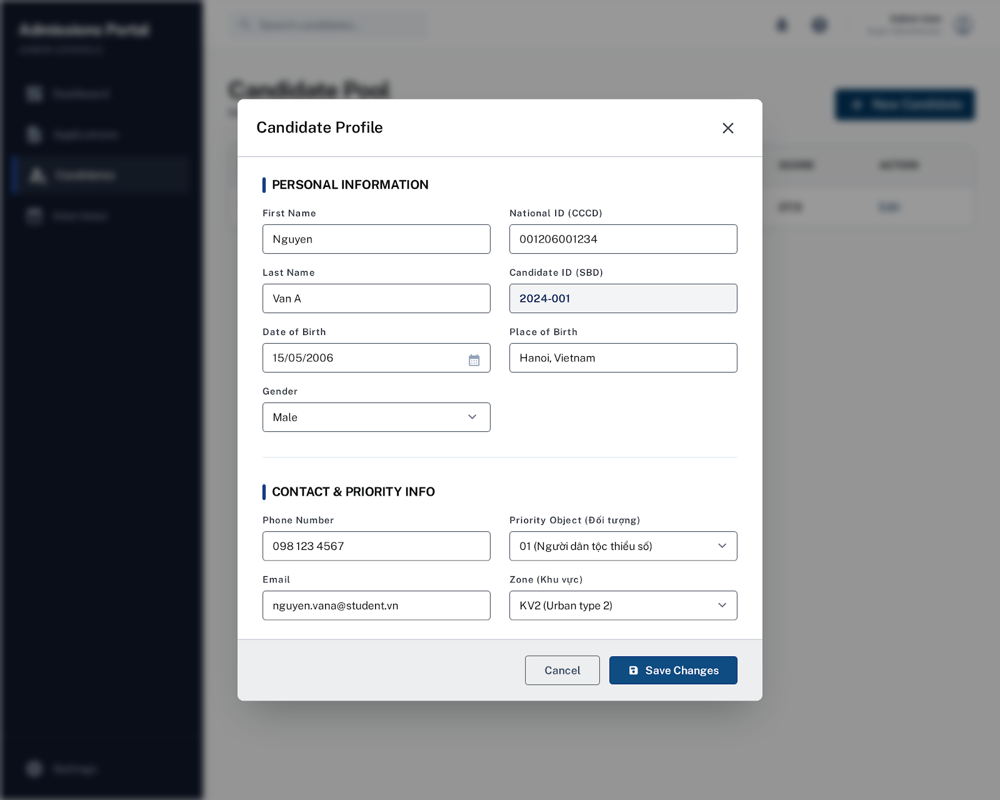

# GUI Components - Thư viện UI tái sử dụng

Thư mục này chứa các component UI được tùy chỉnh và tái sử dụng trên toàn ứng dụng. Tất cả đều kế thừa từ Swing components và được style với **FlatLaf** look and feel.

Trong các ví dụ bên dưới, phần như `tên frame`, `tên panel`, `chiều ngang`, `chiều cao` là placeholder để dễ thay trực tiếp vào code thực tế.

---

## 📋 Danh sách Components

### **1. ActionButton.java**
**Mục đích:** Nút hành động đa năng với 3 kiểu màu  
**Cách dùng:**
```java
// Kiểu PRIMARY (xanh dương) - mặc định
ActionButton btnEdit = new ActionButton("Nội dung nút", "/assets/icons/ten-icon.png", "PRIMARY");

// Kiểu TERTIARY (nâu cam) - sửa/cảnh báo
ActionButton btnDelete = new ActionButton("Nội dung nút", "/assets/icons/ten-icon.png", "TERTIARY");

// Kiểu DANGER (đỏ) - xóa
ActionButton btnRemove = new ActionButton("Nội dung nút", "/assets/icons/ten-icon.png", "DANGER");
```

---

### **2. AddAndConfirmButton.java**
**Mục đích:** Nút "Thêm" / "Xác nhận" với nền xanh navy  
**Cách dùng:**
```java
AddAndConfirmButton btnConfirm = new AddAndConfirmButton("Nội dung nút");
tênPanel.add(btnConfirm);
```

---

### **3. CancelButton.java**
**Mục đích:** Nút "Hủy" / "Thoát" với nền trắng  
**Cách dùng:**
```java
CancelButton btnCancel = new CancelButton("Nội dung nút");
tênPanel.add(btnCancel);
```

---

### **4. AppTheme.java**
**Mục đích:** Bảng màu và font chuẩn toàn ứng dụng (không phải component mà là hằng số)  
**Cách dùng:**
```java
// Sử dụng màu chuẩn thay vì hardcode
setBackground(AppTheme.PRIMARY);
setForeground(AppTheme.TEXT_DARK);
```
**Các hằng số có sẵn:**
- `PRIMARY` - Xanh dương (header, nút chính)
- `SECONDARY` - Xanh xám (nút phụ)
- `TERTIARY` - Nâu cam (nút edit/warning)
- `NEUTRAL` - Xám nhạt (nền)
- `DANGER` - Đỏ (xóa)
- `TEXT_DARK` - Chữ tối

---

### **5. AppTitle.java**
**Mục đích:** Header/Title bar của cửa sổ ứng dụng  
**Cách dùng:**
```java
JFrame tênFrame = new JFrame();
AppTitle titleBar = new AppTitle(tênFrame);
tênFrame.add(titleBar, BorderLayout.NORTH);
```

---

### **6. ComboBox.java**
**Mục đích:** Dropdown tùy chỉnh hỗ trợ generic  
**Cách dùng:**
```java
// Với mảng string
ComboBox<String> combo1 = new ComboBox<>(new String[]{"Tùy chọn 1", "Tùy chọn 2"});

// Với List object (vd: List<SubjectDTO>)
ComboBox<SubjectDTO> combo2 = new ComboBox<>(danhSachDoiTuong, "Nội dung placeholder");
```

---

### **7. CustomTable.java**
**Mục đích:** Bảng dữ liệu với styling tùy chỉnh (padding, màu, font)  
**Cách dùng:**
```java
DefaultTableModel model = new DefaultTableModel();
model.addColumn("Tên cột");
model.addRow(new Object[]{"Giá trị ô dữ liệu"});

CustomTable table = new CustomTable(model);
tênPanel.add(new JScrollPane(table));
```
**Đặc điểm:**
- Hàng cao 45px, padding bên trái
- Header màu trắng, chữ xám
- Selection màu xám nhạt
- Đường kẻ nhẹ

---

### **8. Details.java**
**Mục đích:** Component cặp nhãn-giá trị (tên trường + input)  
**Cách dùng:**
```java
// Với JTextField
Details detail1 = new Details("Tên trường:", new JTextField("Giá trị nhập"));

// Với component khác (ComboBox, TextBox...)
Details detail2 = new Details("Tên trường:", new ComboBox<>(danhSach, "Placeholder"));

tênPanel.add(detail1);
tênPanel.add(detail2);
```

---

### **9. ImportPanel.java**
**Mục đích:** Panel import file Excel (drag & drop hoặc chọn file)  
**Cách dùng:**
```java
ImportPanel importPanel = new ImportPanel(
    file -> {
        // Xử lý file Excel được chọn
        System.out.println("Imported: " + file.getName());
    },
    () -> {
        // Xử lý khi hủy
        System.out.println("Import cancelled");
    }
);

JDialog tênDialog = new JDialog();
tênDialog.add(importPanel);
tênDialog.setVisible(true);
```
**Đặc điểm:**
- Toggle giữa 2 mode: upload zone (drag & drop) và file selected
- Kiểm tra extension (.xls, .xlsx)
- Nút OK/Hủy ở cuối

---

### **10. NormalItem.java**
**Mục đích:** Menu item chuẩn cho Sidebar  
**Cách dùng:**
```java
NormalItem item = new NormalItem("Tên menu", "/assets/icons/ten-icon.png");
item.addActionListener(e -> {
    // Xử lý khi click
});
```

---

### **11. OverlayUtil.java**
**Mục đích:** Utility hiển thị modal dialog (overlay + dim)  
**Cách dùng:**
```java
JPanel tênPanel = new JPanel();
// Thêm nội dung vào tênPanel...

OverlayUtil.showOverlay(tênFrame, "Tiêu đề overlay", tênPanel, 
    new Dimension(chiềuNgang, chiềuCao));
```
**Ý nghĩa tham số:**
- `tênFrame`: `JFrame` cha đang mở sẵn, overlay sẽ phủ lên đúng cửa sổ này.
- `"Tiêu đề overlay"`: dòng tiêu đề hiển thị ở phần header của card trắng.
- `tênPanel`: panel hoặc form muốn nhúng vào giữa overlay.
- `new Dimension(chiềuNgang, chiềuCao)`: kích thước của card trắng ở giữa màn hình.

**Cách hoạt động:**
- Nền bên ngoài bị làm mờ để người dùng tập trung vào form đang mở.
- Card trắng nằm giữa, giống một hộp thoại modal nhẹ.
- Có nút đóng ở góc phải, click ra ngoài card cũng có thể đóng.
- Hợp cho các luồng như thêm mới, xem chi tiết, chỉnh sửa, hoặc import dữ liệu.

**Ví dụ ảnh minh họa:**
```markdown

```
**Đặc điểm:**
- Nền mờ đen toàn màn hình
- Card trắng ở giữa với title và nút close
- Click ngoài card để đóng

---

### **12. Pagination.java & PaginationItem.java**
**Mục đích:** Component phân trang (số trang, next, prev...)  
**Cách dùng:**
```java
Pagination pagination = new Pagination();
pagination.setTotalItems(tổngSốDòng, sốDòngMỗiTrang); // ví dụ: 100 item, 10 item/trang
pagination.addListener(pageNum -> {
    // Xử lý khi user chuyển trang
    loadDataForPage(pageNum);
});
add(pagination);
```

---

### **13. Sidebar.java**
**Mục đích:** Thanh điều hướng bên trái  
**Cách dùng:**
```java
AccountDTO currentUser = new AccountDTO();
Sidebar sidebar = new Sidebar(currentUser, tênMenu -> {
    // Xử lý khi click menu
    if ("Candidates".equals(tênMenu)) {
        showCandidatePage();
    }
});
tênFrame.add(sidebar, BorderLayout.WEST);
```

---

### **14. TextBox.java**
**Mục đích:** TextField tùy chỉnh với placeholder + icon  
**Cách dùng:**
```java
// Chỉ placeholder
TextBox tb1 = new TextBox("Nội dung placeholder");

// Với icon
TextBox tb2 = new TextBox("Nội dung placeholder", new ImageIcon("đường-dẫn-icon.png"));

// Đổi icon sau
tb2.setIcon(new ImageIcon("đường-dẫn-icon-khác.png"));
```

---

### **15. PageHeader.java**
**Mục đích:** Header chuẩn cho trang quản trị (title + subtitle)  
**Cách dùng:**
```java
PageHeader header = new PageHeader("Quản lý người dùng", "Xem, sửa và quản lý tài khoản hệ thống.");
panel.add(header, BorderLayout.NORTH);
```

---

### **16. TableActionPanel.java**
**Mục đích:** Panel nút thao tác trong ô của `JTable` (ví dụ: `Xem`, `Sửa`)  
**Cách dùng:**
```java
TableActionPanel actionPanel = new TableActionPanel();
actionPanel.initEvent(new TableActionEvent() {
    @Override public void onView(int row) { /* mở chi tiết */ }
    @Override public void onEdit(int row) { /* mở form sửa */ }
    @Override public void onDelete(int row) { /* tùy chọn */ }
}, 0);
```

---

### **17. TableActionCellRender.java**
**Mục đích:** Renderer cho cột hành động của `JTable` để luôn hiển thị nút  
**Cách dùng:**
```java
table.getColumnModel().getColumn(4).setCellRenderer(new TableActionCellRender());
```

---

### **18. TableActionCellEditor.java**
**Mục đích:** Editor cho cột hành động của `JTable`, bắt sự kiện click nút trong cell  
**Cách dùng:**
```java
table.getColumnModel().getColumn(4).setCellEditor(new TableActionCellEditor(new TableActionEvent() {
    @Override public void onView(int row) { /* xử lý */ }
    @Override public void onEdit(int row) { /* xử lý */ }
    @Override public void onDelete(int row) { /* xử lý */ }
}));
```

**Lưu ý quan trọng khi dùng action column:**
- Cột hành động phải editable (vd: `return column == 4;` trong `isCellEditable`).
- Giá trị cột action nên để chuỗi rỗng `""`, nút sẽ do renderer/editor vẽ.
- Nếu dùng `CustomTable`, ưu tiên renderer riêng của cột để tránh bị renderer mặc định ghi đè.

---

### **19. PanelAction.java**
**Mục đích:** Panel action kiểu cũ (`Edit`, `Delete`) cho các bảng cũ  
**Ghi chú:**
- Dùng khi cần giữ tương thích với các màn hình cũ.
- Với màn hình mới, ưu tiên `TableActionPanel` + `TableActionCellRender` + `TableActionCellEditor`.

---

## 🎨 Hướng dẫn Styling

Tất cả components sử dụng **FlatLaf** properties. Để tùy chỉnh thêm:

```java
// Cách 1: Sửa trực tiếp trong component
button.putClientProperty("FlatLaf.style", 
    "background: #FF0000; foreground: #FFFFFF; arc: 10;");

// Cách 2: Dùng AppTheme constants (khuyến nghị)
button.setBackground(AppTheme.PRIMARY);
```

**Các property phổ biến:**
- `background` - Màu nền
- `foreground` - Màu chữ
- `hoverBackground` - Màu khi di chuột
- `arc` - Bo góc (đơn vị pixel)
- `borderWidth` - Độ dày viền
- `focusWidth` - Viền khi focus (thường set 0)

---

## 📌 Best Practices

1. **Luôn dùng AppTheme cho màu** thay vì hardcode màu hex
2. **Reuse components** - Không tạo button mới nếu `ActionButton` đã có
3. **Đặt tên rõ ràng** - `btnSubmit`, `tfUsername` giúp code dễ hiểu
4. **Gói vào null check** - Luôn kiểm tra null khi load icon/image
5. **Dùng LayoutManager** - BorderLayout, BoxLayout cho layout chỉnh chủ

---

## 🔗 Liên kết

- **Theme:** [AppTheme.java](AppTheme.java)
- **Ví dụ dùng Components:** `src/main/java/com/example/gui/pages/`

